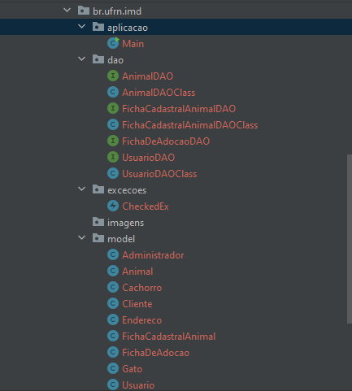
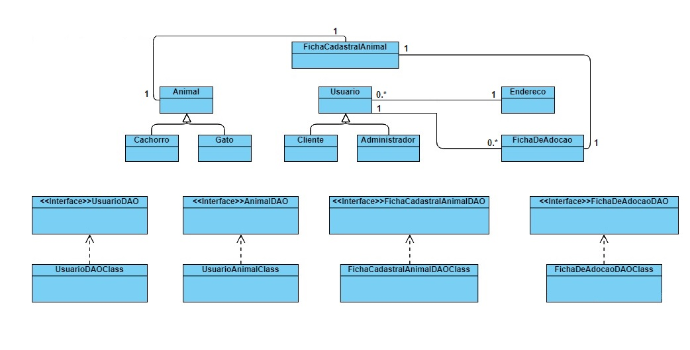

# Projeto Adotando Amor
Adotando Amor é um projeto em que qualquer pessoa pode divulgar cães e gatos para adoção de forma online.

## Objetivos

Adotando com amor foi idealizado com o próposito de tornar a adoção algo com mais visibilidade e viabilidade.

Projeto desenvolvido e apresentado ao curso de Tecnologia da Informação da Universidade Federal do Rio Grande do Norte, como requisito parcial para obtenção de nota na disciplina de Linguagem de Programação II, ministrada pelo professor Gustavo Bezerra Paz Leitão(*<gustavo.leitao@imd.ufrn.br>*).


## Sobre o projeto
<center>

</center>
O projeto Adotando Amor foi desenvolvido utilizando da linguagem Java utilizando do sistema de automação Gradle.

## Organização do projeto
O projeto foi subdividio em três pastas pastas sendo elas aplicacao, dao, exxcecoes e model, que respectivamente são responsáveis pela exibição e manutenção da aplicação, manipulação de dados, modelo de excecoes e modelos de objetos. 

<center>

</center>

A estruturação do projeto pode ser verificada de forma simplificada de acordo com o diagrama de classes abaixo:

<center>

</center>

## Compilando e executando com Javac
```
javac @sources.txt
java br/ufrn/imd/aplicacao/Main
```

## Vídeo explicativo
https://youtu.be/ieawp9-nLHk

## Autor

Bruno Kaike do Nascimento Batista -
[GitHub](https://github.com/BrunoKaike)

## Contato

Bruno Kaike do Nascimento Batista -
*<brunokaike@ufrn.edu.br>*

Link do projeto: [https://github.com/imetropoledigital/imd0040-trabalho-final-bruno](https://github.com/imetropoledigital/imd0040-trabalho-final-bruno)
